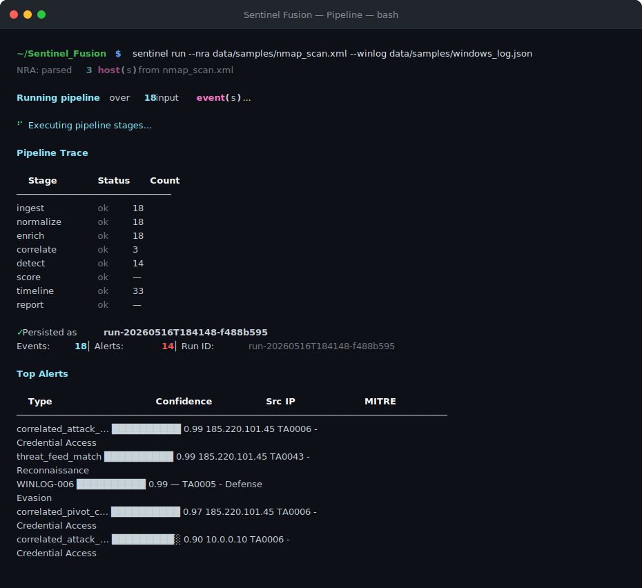
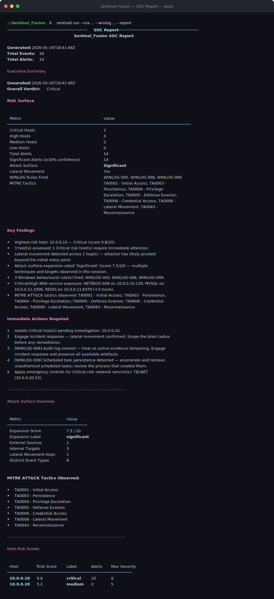

# Sentinel_Fusion

> SOC-grade detection, correlation, and reporting platform — from raw network scans and Windows event logs to an executive incident report in under a second.


Sentinel_Fusion is a 10-stage detection pipeline that ingests Nmap scans and Windows Event Logs, correlates them into attack chains, and produces structured JSON and Markdown SOC reports with host risk scores, MITRE ATT&CK mappings, WINLOG behavioral alerts, per-service triage recommendations, and proactive cross-run threat hunting.

**v3 adds:** Elasticsearch SIEM integration, MITRE ATT&CK Navigator layer export, and live threat feed ingestion (abuse.ch Feodo Tracker, Emerging Threats, AlienVault OTX).

Incorporates the full logic of:
- **nmap-recon-analyzer** — Nmap XML parsing, service risk scoring, CVE mapping, SOC triage recommendations
- **winlog-soc-analyzer** — Windows Event Log parsing, event classification, 9 behavioral correlation rules

---

## Quick Start

```bash
# Install dependencies
pip install -r requirements.txt

# Run against an Nmap scan
sentinel run --nra data/samples/nmap_scan.xml

# Run against Nmap + Windows logs (prints full Markdown report)
sentinel run --nra data/samples/nmap_scan.xml --winlog data/samples/windows_log.json --report

# Run against simulated attack data
sentinel run --mock data/samples/simulated_attack.json

# Watch a file for new events and run the pipeline continuously
sentinel watch --winlog data/samples/windows_log.json --interval 10

# Start the REST API
python api/run.py            # → http://localhost:8000
# or
uvicorn api.app:app --reload

# Run the test suite
pytest tests/
```

---

## Screenshots

**Pipeline execution — 10-stage trace with live alert feed:**



**SOC Report — executive summary, risk scores, and immediate actions:**



---

## Sample Output

Running `sentinel run --nra data/samples/nmap_scan.xml --winlog data/samples/windows_log.json` against a 3-host network with an active brute-force + lateral movement scenario produces:

```
## Executive Summary
Overall Verdict: Critical

### Risk Surface
| Metric              | Value                         |
|---------------------|-------------------------------|
| Critical Hosts      | 1                             |
| Total Alerts        | 13                            |
| Attack Surface      | Significant (7.5/10)          |
| Lateral Movement    | Yes (1 hop)                   |
| WINLOG Rules Fired  | WINLOG-005, WINLOG-006, WINLOG-009 |

### Key Findings
- Highest-risk host: 10.0.0.10 — Critical (score 9.8/10)
- Lateral movement detected — attacker pivoted to 10.0.0.11
- Audit log cleared (WINLOG-006) — active evidence tampering
- Scheduled task persistence (WINLOG-009) on compromised host
- Critical/High NRA service exposure: SMB, MSSQL, RDP on 10.0.0.10

### Immediate Actions Required
1. Isolate 10.0.0.10 pending investigation
2. Engage incident response — lateral movement confirmed
3. [WINLOG-006] Preserve all artefacts; treat as active IR
4. [WINLOG-009] Enumerate and remove unauthorised scheduled tasks
5. Emergency controls for TELNET (10.0.0.20:23)

### Host Risk Scores
| Host        | Score   | Label    |
|-------------|---------|----------|
| 10.0.0.10   | 9.8/10  | critical |
| 10.0.0.20   | 5.2/10  | medium   |
| 10.0.0.11   | 4.0/10  | medium   |

### NRA Recommended Actions (excerpt)
Port 3389/tcp — RDP (Critical, Priority 1)
  Context: Primary ransomware delivery vector; NLA bypass risk.
  CVEs: CVE-2019-0708 (BlueKeep), CVE-2019-1181, CVE-2019-1182
  Action: Isolate immediately. Test for BlueKeep. Review all RDP
          session logs for evidence of lateral movement.

Port 445/tcp — SMB (High, Priority 2)
  CVEs: CVE-2017-0144 (EternalBlue), CVE-2020-0796 (SMBGhost)
  Action: Confirm SMBv1 is disabled. Audit share permissions.
          Apply MS17-010 and KB4551762 patches.
```

Full sample output: [`data/samples/sample_report.md`](data/samples/sample_report.md) · [`data/samples/sample_report.json`](data/samples/sample_report.json)

---

## Pipeline Architecture

All data follows this strict 10-stage sequence — no step may be skipped or reordered:

| # | Stage | Module | What it does |
|---|-------|--------|--------------|
| 1 | Ingest | `core/pipeline/ingest.py` | Loads raw files into dicts; no transformation |
| 2 | Normalize | `core/pipeline/normalize.py` | Maps all sources to a unified event schema |
| 3 | Enrich | `core/pipeline/enrich.py` | IP reputation, geo, threat feeds, service context |
| 4 | Sigma | `detection/sigma_engine.py` | 10 MITRE-mapped Sigma rules; confidence-scored alerts |
| 5 | Correlate | `detection/correlation_engine.py` | Groups events into attack chains |
| 6 | Detect | `detection/` | Stateless detectors emit confidence-scored alerts |
| 7 | Score | `scoring/` | Host risk (0–10), asset exposure, attack surface |
| 8 | Timeline | `narrative/timeline_builder.py` | Chronological events + SOC narrative |
| 9 | Report | `reporting/report_generator.py` | JSON + Markdown with executive summary and NRA triage |
| 10 | Hunt | `hunting/hunt_engine.py` | Cross-run proactive threat hunting — surfaces low-and-slow patterns invisible to the live pipeline |

The orchestrator (`core/pipeline/orchestrator.py`) drives the full run. `StorageLayer.persist_run()` is the only caller that writes a complete result to the database.

---

## v3 Features

### Elasticsearch SIEM Integration
Forwards alerts, host risk scores, and hunt findings to Elasticsearch after every pipeline run. Four rolling daily indices: `sentinel-alerts`, `sentinel-scores`, `sentinel-hunt`, `sentinel-runs`. Kibana dashboard included via Docker.

```bash
# Start Sentinel + Elasticsearch + Kibana
docker-compose up

# Enable forwarding
SENTINEL_ELASTIC_ENABLED=true
SENTINEL_ELASTIC_URL=http://localhost:9200
# Kibana → http://localhost:5601
```

### MITRE ATT&CK Navigator Export
Every pipeline run produces a Navigator 4.x layer JSON. Techniques are confidence-scored (0–100) and colour-coded: red (≥70%), orange (40–69%), yellow (<40%). Sub-techniques are tracked independently.

```bash
# Download Navigator layer for a run
GET /api/v1/pipeline/runs/{run_id}/navigator
# Import at https://mitre-attack.github.io/attack-navigator/
```

### Live Threat Feed Ingestion
Upgrades the enrichment stage from a static seed table to a live three-tier feed engine. Two no-key feeds updated hourly/daily; optional AlienVault OTX for per-IP lookups.

| Feed | Source | Covers |
|------|--------|--------|
| Feodo Tracker | abuse.ch | Active C2 botnet IPs (hourly) |
| Emerging Threats | Proofpoint | Compromised host IPs (daily) |
| OTX | AlienVault | Per-IP threat intel (API key optional) |

```bash
SENTINEL_FEEDS_ENABLED=true
SENTINEL_OTX_KEY=your-key   # optional
```

---

## Detection Capabilities

### Threat Hunt Engine (Stage 10 — cross-run)

| Hunt Type | What it finds | MITRE Tactic |
|-----------|---------------|--------------|
| `low_and_slow_brute_force` | Same src_ip with auth failures across 3+ runs, each below the live threshold | TA0006 - Credential Access |
| `alert_cluster` | Same src_ip with 3+ open alerts individually dismissed but collectively significant | TA0043 - Reconnaissance |
| `beacon` | Same (src_ip → dst_ip) pair in 5+ separate runs — consistent with C2 check-in | TA0011 - Command and Control |
| `persistent_threat_actor` | Same external src_ip appearing in events across 5+ separate runs | TA0043 - Reconnaissance |

Hunt findings appear in `hunt_findings` in the pipeline output alongside `alerts`. Each finding includes `hunt_confidence`, MITRE tactic, `run_count`, evidence dict, and a plain-English `analyst_note`.

### Sigma Engine (10 built-in rules)
| Rule ID | Title | MITRE Tactic |
|---------|-------|--------------|
| SF-SIG-001 | CertUtil LOLBin Abuse | TA0005 - Defense Evasion |
| SF-SIG-002 | Encoded PowerShell Execution | TA0002 - Execution |
| SF-SIG-003 | PowerShell Download Cradle | TA0011 - Command and Control |
| SF-SIG-004 | LSASS Memory Access | TA0006 - Credential Access |
| SF-SIG-005 | PsExec Lateral Movement | TA0008 - Lateral Movement |
| SF-SIG-006 | Shadow Copy Deletion | TA0040 - Impact |
| SF-SIG-007 | WMI Persistence | TA0003 - Persistence |
| SF-SIG-008 | Suspicious Scheduled Task | TA0003 - Persistence |
| SF-SIG-009 | NTDS.dit Access | TA0006 - Credential Access |
| SF-SIG-010 | Anomalous Logon from External IP | TA0001 - Initial Access |

### Network (NRA)
- Service risk scoring for 30+ protocols (RDP, SMB, SSH, MySQL, Redis, Elasticsearch, etc.)
- Dangerous service combination detection (SMB+RDP → ransomware staging, SSH+MySQL → lateral movement risk)
- Per-port SOC triage: service context, risk rationale, immediate action steps, CVE references
- MITRE ATT&CK phase mapping per service

### Windows Event Logs (WINLOG)
| Rule | Event IDs | What it catches |
|------|-----------|-----------------|
| WINLOG-001 | 4625 | Brute-force login attempt burst |
| WINLOG-002 | 4625 + 4624 | Brute-force succeeded — credential compromise |
| WINLOG-003 | 4728/4732/4756 | Backdoor account added to security group |
| WINLOG-004 | 4648 + 4624 (type 3) | Lateral movement via explicit credentials |
| WINLOG-005 | 4624 (type 3) + 4672 | Privilege escalation — remote logon with special privs |
| WINLOG-006 | 1102 | Audit log cleared — evidence tampering |
| WINLOG-007 | 4719 | Audit policy changed |
| WINLOG-008 | 4697 / 7045 | New service installed — persistence |
| WINLOG-009 | 4698 | Scheduled task created — persistence |

---

## REST API

All routes are under `/api/v1/`. Start the server with `python api/run.py` or `uvicorn api.app:app --reload`.

```
GET  /api/v1/health                          Liveness check
GET  /api/v1/status                          Platform statistics (totals, top risk hosts, alert breakdown)
POST /api/v1/pipeline/run                    Run the pipeline (JSON body: {nra, winlog, mock} event arrays)
GET  /api/v1/pipeline/runs                   Pipeline run history
GET  /api/v1/pipeline/runs/{run_id}          Get a specific pipeline run
GET  /api/v1/pipeline/runs/{run_id}/navigator  Download ATT&CK Navigator layer (JSON)
GET  /api/v1/events                          Query stored normalized events
GET  /api/v1/alerts                          Query stored alerts (filterable by status, confidence)
PATCH /api/v1/alerts/{id}/status             Update alert status (open → investigating → contained → closed)
GET  /api/v1/cases                           List incident cases (Kanban: open/investigating/contained/closed)
GET  /api/v1/scores/hosts                    Latest host risk scores
GET  /api/v1/scores/hosts/{ip}               Risk score history for a specific host
GET  /api/v1/scores/attack-surface           Attack surface expansion history
GET  /api/v1/intel/ip/{ip}                   IP threat intelligence (reputation + geo + feed hits)
```

Interactive docs at `http://localhost:8000/docs` · Dashboard at `http://localhost:8000/dashboard`

---

## Supported Input Sources

| Source | Native format | JSON fallback |
|--------|---------------|---------------|
| NRA (Nmap) | `.xml` — parsed per host via `nra_parser` | `.json` array of host dicts |
| Winlog | `.evtx` — parsed via `winlog_parser` (`pip install python-evtx`) | `.json` array of event dicts |
| Simulated | — | `.json` array of mock event dicts |

---

## Project Structure

```
Sentinel_Fusion/
├── api/                            # FastAPI REST layer
│   ├── app.py                      # App factory and middleware
│   ├── dependencies.py             # Shared dependency injection
│   ├── run.py                      # Uvicorn entrypoint
│   ├── routes/
│   │   ├── alerts.py
│   │   ├── cases.py
│   │   ├── events.py
│   │   ├── health.py
│   │   ├── intel.py
│   │   ├── pipeline.py
│   │   └── scores.py
│   └── schemas/
│       ├── requests.py
│       └── responses.py
│
├── config/
│   └── settings.py                 # Global configuration and env vars
│
├── core/                           # Pipeline stages
│   ├── pipeline/
│   │   ├── ingest.py               # Stage 1 — raw source ingestion
│   │   ├── nra_parser.py           # Nmap XML file parser (called by ingest)
│   │   ├── winlog_parser.py        # .evtx binary file parser (called by ingest)
│   │   ├── normalize.py            # Stage 2 — unified event schema
│   │   ├── enrich.py               # Stage 3 — metadata enrichment
│   │   ├── context_builder.py      # Host/asset context assembly (called by enrich)
│   │   └── orchestrator.py         # Runs the full pipeline end-to-end
│   └── utils/
│       └── ip_utils.py
│
├── hunting/                        # Stage 10 — proactive cross-run threat hunting
│   └── hunt_engine.py              # HuntEngine: low-and-slow BF, beacon, alert cluster, persistent actor
│
├── detection/                      # Stages 4, 5 & 6 — Sigma engine, correlation, and stateless detectors
│   ├── sigma_field_mapper.py       # Stage 4 — maps Sigma field names to normalized schema
│   ├── sigma_engine.py             # Stage 4 — 10 MITRE-mapped Sigma-compatible rules
│   ├── correlation_engine.py       # Stage 5 — event correlation / attack chain
│   ├── anomaly_detection.py        # Stage 6
│   ├── brute_force_detection.py    # Stage 6
│   ├── lateral_movement_detection.py  # Stage 6
│   └── winlog_rules.py             # Stage 6 — 9 behavioral rules (brute force, lateral movement, persistence, etc.)
│
├── scoring/                        # Stage 7 — risk scoring
│   ├── host_risk.py
│   ├── asset_risk.py
│   └── attack_surface.py
│
├── narrative/                      # Stage 8 — timeline and story engine
│   ├── timeline_builder.py         # Builds chronological attack timeline
│   └── attack_story_engine.py      # Converts detections into SOC narratives
│
├── reporting/                      # Stage 9 — output generation
│   ├── report_generator.py         # JSON and Markdown report builder
│   ├── executive_summary.py        # CISO-facing verdict, key findings, immediate actions
│   ├── recommended_actions.py      # Per-port SOC triage recommendations (NRA engine)
│   └── navigator_export.py         # MITRE ATT&CK Navigator 4.x layer export
│
├── siem/                           # SIEM integrations
│   └── elastic_forwarder.py        # Elasticsearch forwarder — alerts, scores, hunt findings
│
├── intelligence/                   # Enrichment data providers (called by enrich.py)
│   ├── _http.py                    # Shared stdlib HTTP helper for live API calls
│   ├── ip_reputation.py            # IP reputation: seed table → AbuseIPDB → stub fallback
│   ├── geo_enrichment.py           # Geolocation: seed table → ip-api.com → stub fallback
│   ├── threat_feeds.py             # Live feeds: Feodo Tracker → Emerging Threats → OTX → seed
│   ├── threat_enricher.py          # Synthesizes rep + geo + feeds into a single composite assessment
│   ├── event_intelligence.py       # Windows Event ID knowledge base (MITRE, severity, analyst notes)
│   └── service_intelligence.py     # Network service knowledge base (risk scores, threat descriptions, CVEs)
│
├── storage/                        # Persistence layer
│   ├── database.py                 # SQLite connection, WAL mode, migrations runner
│   ├── schema.py                   # DDL and versioned MIGRATIONS dict
│   ├── models.py                   # Dataclasses: StoredEvent, StoredAlert, StoredCase, StoredScore, AuditEntry, PipelineRun
│   ├── store.py                    # StorageLayer facade (single write entrypoint)
│   └── repositories/
│       ├── events.py
│       ├── alerts.py
│       ├── cases.py
│       ├── scores.py
│       └── audit.py
│
├── interface/                      # CLI and terminal UI
│   ├── cli.py                      # Typer root command group
│   ├── banner.py
│   ├── output.py                   # Shared Rich/table formatting helpers
│   ├── _state.py                   # Shared CLI state
│   ├── commands/
│   │   ├── __init__.py
│   │   ├── pipeline.py             # sentinel run
│   │   ├── watch.py                # sentinel watch — continuous file-tail mode
│   │   ├── alerts.py
│   │   ├── cases.py
│   │   ├── events.py
│   │   ├── intel.py
│   │   ├── scores.py
│   │   ├── runs.py
│   │   ├── status.py
│   │   └── purge.py
│   └── dashboard/
│       └── index.html              # Static web dashboard
│
├── demo/                           # Demo and simulation tools
│   ├── demo_runner.py
│   ├── live_attack_simulation.py
│   └── terminal_dashboard.py
│
├── data/
│   └── samples/
│       ├── nmap_scan.xml           # 3-host Nmap scan (RDP/SMB/MSSQL, SSH/MySQL/Redis, Telnet/FTP/VNC)
│       ├── windows_log.json        # 15 Windows events (brute force, lateral movement, persistence)
│       ├── simulated_attack.json   # Mock attack chain
│       ├── sample_report.json      # Full pipeline output (JSON)
│       └── sample_report.md        # Full pipeline output (Markdown)
│
├── scripts/                        # Shell helper scripts
│   ├── run_demo.sh
│   ├── simulate_attack.sh
│   └── generate_report.sh
│
├── tests/                          # Pytest test suite
│   ├── test_ingest.py
│   ├── test_normalize.py
│   ├── test_enrich.py
│   ├── test_context_builder.py
│   ├── test_correlation_engine.py  # includes pivot chain detection tests
│   ├── test_anomaly_detection.py
│   ├── test_brute_force_detection.py
│   ├── test_lateral_movement_detection.py
│   ├── test_winlog_rules.py
│   ├── test_winlog_parser.py
│   ├── test_nra_parser.py
│   ├── test_scoring.py
│   ├── test_narrative.py
│   ├── test_report_generator.py
│   ├── test_recommended_actions.py
│   ├── test_intelligence.py
│   ├── test_intelligence_consistency.py
│   ├── test_intelligence_live.py   # cache, fallback, and API failure tests
│   ├── test_event_intelligence.py
│   ├── test_service_intelligence.py
│   ├── test_storage.py
│   ├── test_sigma_field_mapper.py
│   ├── test_sigma_engine.py
│   ├── test_threat_enricher.py
│   ├── test_threat_feeds_live.py   # live feed fetching, caching, OTX integration
│   ├── test_hunt_engine.py
│   ├── test_orchestrator.py
│   ├── test_api.py                 # includes API key auth tests
│   ├── test_cli.py
│   ├── test_watch.py               # FileCursor and watch cycle tests
│   ├── test_elastic_forwarder.py   # Elasticsearch SIEM forwarding
│   └── test_navigator_export.py    # MITRE ATT&CK Navigator layer export
│
├── docs/
│   ├── ARCHITECTURE.md             # Full system architecture design document
│   └── SENTINEL_FUSION_GUIDE.md    # Complete module-by-module study guide
├── sentinel.db                     # SQLite database (runtime artifact, gitignored)
├── Dockerfile
├── docker-compose.yml
├── setup.py
├── requirements.txt
├── requirements-dev.txt
├── .gitignore
├── CLAUDE.md                       # Architecture rules and design constraints
└── LICENSE
```

---

## Running Tests

```bash
pytest tests/           # 972 tests, ~3s
pytest tests/ -v        # verbose output per test
```
